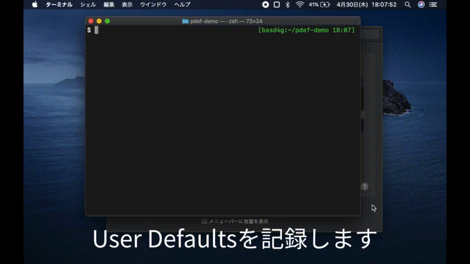

[](https://github.com/basd4g/pdef/actions)
# pdef

pdef generates shell-script to set Mac OS X User Defaults (property list).

## Description

Before and after you set any environmental settings from GUI, please write out property lists to files.

pdef generates a shell-script with comparing files of a property list.

Next time you set the same environmental settings, you only execute the shell-script without manipulating GUI.

## Install

```sh
$ git clone https://github.com/basd4g/pdef
$ cd pdef
$ make
$ cp bin/pdef /usr/local/bin/
```

## Uninstall

```sh
$ rm /usr/local/bin/pdef 
```

## Usage

```sh
$ defaults read > before

# Set any settings on GUI

$ defaults read > after

$ pdef before after > path/to/file
```

## Demo



## License

[MIT](https://github.com/basd4g/pdef/blob/master/LICENSE)

## Auther

[basd4g](https://github.com/basd4g)

